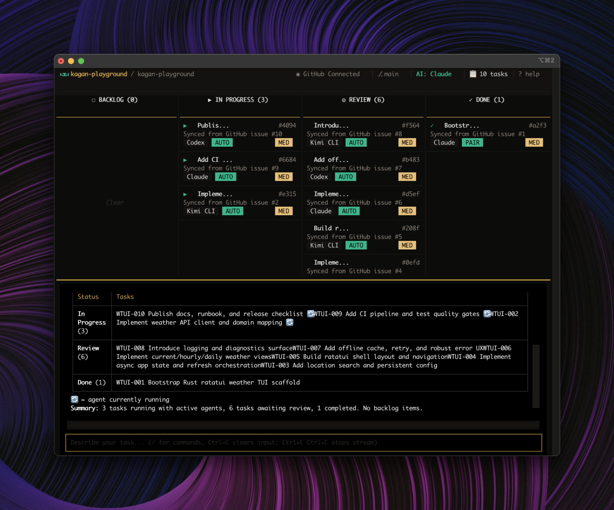

<p align="center">
  <picture>
    <source media="(prefers-color-scheme: dark)" srcset=".github/assets/logo-dark.svg">
    <source media="(prefers-color-scheme: light)" srcset=".github/assets/logo-light.svg">
    
  </picture>
</p>

<p align="center">
  <strong>A terminal task board that runs AI agents on your code — you review, you decide, you merge.</strong>
</p>

<p align="center">
  <a href="https://pypi.org/project/kagan/"></a>
  <a href="https://pypi.org/project/kagan/"></a>
  <a href="https://opensource.org/license/MIT"></a>
  <a href="https://github.com/aorumbayev/kagan/stargazers"></a>
  <a href="https://discord.gg/dB5AgMwWMy"></a>
</p>

<p align="center">
  <a href="https://snyk.io/test/github/kagan-sh/kagan?targetFile=pyproject.toml"></a>
</p>

<p align="center">
  <a href="https://docs.kagan.sh/">Documentation</a> •
  <a href="https://docs.kagan.sh/quickstart/">Quickstart</a> •
  <a href="https://docs.kagan.sh/guides/mcp-setup/">MCP Setup</a> •
  <a href="https://docs.kagan.sh/reference/cli/">CLI Reference</a> •
  <a href="https://github.com/aorumbayev/kagan/issues">Issues</a>
</p>

---

<p align="center">
  
</p>

Create a task. Pick a mode. The agent works. You review, approve, and merge.

## Install

=== "UV (Recommended)"

```bash
uv tool install kagan
```

=== "Mac / Linux"

```bash
curl -fsSL https://uvget.me/install.sh | bash -s -- kagan
```

=== "Windows (PowerShell)"

```powershell
iwr -useb uvget.me/install.ps1 -OutFile install.ps1; .\install.ps1 kagan
```

=== "pip"

```bash
pip install kagan
```

### Requirements

- Python 3.12 -- 3.13, Git, terminal 80x20+
- tmux (recommended for PAIR sessions on macOS/Linux)
- VS Code or Cursor (PAIR launchers, especially on Windows)

## Usage

```bash
kagan              # Launch TUI (default command)
kagan tui          # Launch TUI explicitly
kagan core status  # Show status of the core process
kagan core stop    # Stop the running core process
kagan mcp          # Run as MCP server (connects to core via IPC)
kagan tools        # Stateless developer utilities (prompt enhancement)
kagan update       # Check for and install updates
kagan list         # List all projects with task counts
kagan reset        # Reset data (interactive)
kagan --help       # Show all options
```

## Ways to Use Kagan

### TUI (interactive)

Run `kagan` -- create tasks, run AUTO/PAIR workflows, review/rebase/merge, switch projects.

### Editor (MCP)

Operate Kagan from Claude Code, Gemini CLI, or any MCP-compatible client -- no TUI required:

```bash
kagan mcp --capability pair_worker
```

Start with `pair_worker`. Escalate to `maintainer` when needed. See [MCP setup](https://docs.kagan.sh/guides/mcp-setup/) for editor configs.

## Features

- Kanban lifecycle: `BACKLOG -> IN_PROGRESS -> REVIEW -> DONE`
- Task CRUD, duplicate, inspect
- Work modes: `AUTO` (background agent) / `PAIR` (interactive session)
- Chat-driven planning with approval flow
- Review: diff, approve/reject/rebase/merge
- Multi-repo: project switching, base-branch controls
- PAIR handoff: tmux / VS Code / Cursor session management
- MCP: 23 tools spanning tasks, sessions, review, planning, projects, audit, settings
- Core daemon management: run, inspect, stop

## Supported Agents

- [Claude Code](https://docs.anthropic.com/en/docs/claude-code) (Anthropic)
- [OpenCode](https://opencode.ai/docs) (SST)
- [Codex](https://github.com/openai/codex) (OpenAI)
- [Gemini CLI](https://github.com/google-gemini/gemini-cli) (Google)
- [Kimi CLI](https://github.com/MoonshotAI/kimi-cli) (Moonshot AI)
- [GitHub Copilot](https://github.com/github/copilot-cli) (GitHub)

## Docs

**[docs.kagan.sh](https://docs.kagan.sh/)** -- [Quickstart](https://docs.kagan.sh/quickstart/) | [MCP Setup](https://docs.kagan.sh/guides/mcp-setup/) | [Editor MCP Setup](https://docs.kagan.sh/guides/editor-mcp-setup/)

## License

[MIT](LICENSE)

---

<p align="center">
  <a href="https://www.star-history.com/#aorumbayev/kagan&type=date">
    <picture>
      <source media="(prefers-color-scheme: dark)" srcset="https://api.star-history.com/svg?repos=aorumbayev/kagan&type=date&theme=dark" />
      <source media="(prefers-color-scheme: light)" srcset="https://api.star-history.com/svg?repos=aorumbayev/kagan&type=date" />
      
    </picture>
  </a>
</p>
