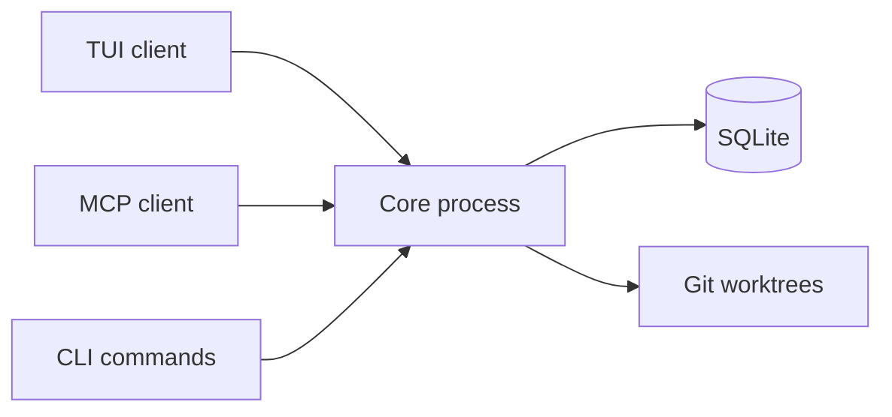

# Architecture overview

One core process. Multiple frontends. Every interface sees the same state in real time.

## Components

| Component     | Purpose                          |
| ------------- | -------------------------------- |
| TUI           | Keyboard-first Kanban board      |
| MCP server    | AI tools that read/mutate state  |
| Core process  | Coordinates operations and state |
| SQLite        | Projects, tasks, reviews         |
| Git worktrees | Isolated task workspaces         |

## Flow

All interfaces share the same state. A task created via MCP appears on the TUI board. A review completed in the TUI is visible to every MCP client.

## Supported agents

Kagan orchestrates 14 coding agents. Each can run in **AUTO** (background) or **PAIR** (interactive) mode. Install one or install them all -- they share the board and compete on merit.

| Agent              | Author       | Install                                                                                      |
| ------------------ | ------------ | -------------------------------------------------------------------------------------------- |
| **Claude Code**    | Anthropic    | `curl -fsSL https://claude.ai/install.sh \| bash`                                            |
| **OpenCode**       | SST          | `npm i -g opencode-ai`                                                                       |
| **Codex**          | OpenAI       | `npm install -g @openai/codex`                                                               |
| **Gemini CLI**     | Google       | `npm install -g @google/gemini-cli`                                                          |
| **Kimi CLI**       | Moonshot AI  | `uv tool install kimi-cli --no-cache`                                                        |
| **GitHub Copilot** | GitHub       | `npm install -g @github/copilot@prerelease`                                                  |
| **Goose**          | Block        | `curl -fsSL https://github.com/block/goose/releases/download/stable/download_cli.sh \| bash` |
| **OpenHands**      | OpenHands    | `uv tool install openhands -U --python 3.12`                                                 |
| **Auggie**         | Augment Code | `npm install -g @augmentcode/auggie`                                                         |
| **Amp**            | Sourcegraph  | `curl -fsSL https://ampcode.com/install.sh \| bash`                                          |
| **Docker cagent**  | Docker       | Docker Desktop 4.49+                                                                         |
| **Stakpak**        | Stakpak      | `cargo install stakpak`                                                                      |
| **Mistral Vibe**   | Mistral      | `curl -LsSf https://mistral.ai/vibe/install.sh \| bash`                                      |
| **VT Code**        | Vinh Nguyen  | `cargo install --git https://github.com/vinhnx/vtcode`                                       |

`kagan doctor` reports which agents are installed and available.

## PAIR backends

PAIR sessions open in your preferred editor or terminal multiplexer:

| Backend       | Tool                                         |
| ------------- | -------------------------------------------- |
| `tmux`        | Terminal multiplexer (default on Unix/macOS) |
| `nvim`        | Neovim with AI chat plugin support           |
| `vscode`      | Visual Studio Code (default on Windows)      |
| `cursor`      | Cursor                                       |
| `windsurf`    | Windsurf                                     |
| `kiro`        | Kiro                                         |
| `antigravity` | Antigravity                                  |

Set globally via `default_pair_terminal_backend` in config, or override per task.

## Plugins

GitHub import is a native feature. A plugin system exists for third-party integrations but is early-stage — see [Plugins](../reference/plugins.md) for current status and how to request new integrations.

## Data

State outside repo: `config.toml`, `kagan.db`, core runtime files, worktrees. No `.kagan/` in repos.

## Troubleshooting

`kagan core status` when connectivity fails. MCP: use `--readonly` or `--admin` access tiers. [Troubleshooting](../troubleshooting.md) for metadata/token/lock issues.
