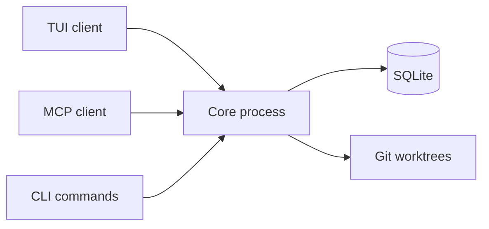

# Architecture overview

## Components

| Component        | Purpose                          |
| ---------------- | -------------------------------- |
| TUI              | Keyboard-first UI                |
| MCP server       | AI tools read/mutate state       |
| Core process     | Coordinates ops and state        |
| SQLite           | Projects, tasks, reviews         |
| Git worktrees    | Isolated task workspaces         |

## Flow

All interfaces share the same state. MCP task → appears in TUI. TUI review → visible to MCP.

## Plugins

Core = single mutable authority. TUI/MCP/CLI never mutate directly. Plugin actions: `capability.method` via registry. GitHub bundled, repos start disconnected. Third-party: local entrypoints in config (no remote fetch).

## Data

State outside repo: `config.toml`, `kagan.db`, core runtime files, worktrees. No `.kagan/` in repos.

## Troubleshooting

`kagan core status` when connectivity fails. MCP: use capability profiles. [Troubleshooting](../troubleshooting.md) for metadata/token/lock issues.
