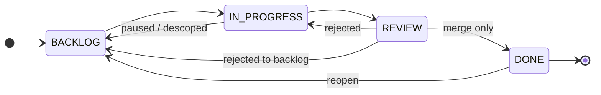

# Task lifecycle

Every task follows the same four-column flow. The board enforces it.



## Statuses

| Status          | Meaning                                     |
| --------------- | ------------------------------------------- |
| **BACKLOG**     | Planned but not started                     |
| **IN_PROGRESS** | Agent running (AUTO) or session open (PAIR) |
| **REVIEW**      | Work complete, awaiting human review        |
| **DONE**        | Reviewed and merged                         |

Moving between columns is constrained. You can drag tasks left or right within the allowed transitions above — but **REVIEW → DONE requires a merge**. No shortcut.

## Worktrees

When a task starts, Kagan creates a **git worktree** — an isolated branch copy of your repo. The agent works there. Your main branch stays untouched.

```
your-repo/
  .git/
  src/                     ← your working copy (unchanged)

~/.local/share/kagan/worktrees/
  task-abc123/             ← agent workspace (isolated branch)
    src/
```

- One worktree per task, per repo.
- Multi-repo projects get one worktree per repo per task.
- Worktrees are cleaned up after merge.
- State lives outside your repo — no `.kagan/` directory in your codebase.

## Execution modes

Each task runs as **AUTO** or **PAIR**. Set the mode when creating or editing a task.

| Mode | Who drives  | Where it happens                                       |
| ---- | ----------- | ------------------------------------------------------ |
| AUTO | Agent       | Background process; follow progress in the TUI overlay |
| PAIR | You + agent | Interactive session in tmux, Neovim, VS Code, etc.     |

[:octicons-arrow-right-24: AUTO vs PAIR guide](../guides/modes-auto-vs-pair.md)

## Review

When work finishes — agent completes (AUTO) or you move the task (PAIR) — it enters REVIEW.

**What you see:**

- Diff summary (files changed, lines added/removed)
- Acceptance criteria checklist (if defined)
- Agent reasoning notes (from `task_add_note` scratchpad entries during the run)

**What you can do:**

| Action  | Effect                                         |
| ------- | ---------------------------------------------- |
| Approve | Records approval; task stays in REVIEW         |
| Reject  | Sends task back to IN_PROGRESS (with notes)    |
| Merge   | Merges worktree branch → base; task → DONE     |
| Rebase  | Rebases worktree onto latest base before merge |

Approve records intent but does not move the task. **Only merge transitions to DONE.**

## Acceptance criteria

Optional. Kagan stores acceptance criteria with the task and shows them during review.

- Tasks with criteria can use AI-assisted review and approval flows.
- Tasks without criteria still run normally, but automated approve/merge actions stay blocked.
- Human review remains available either way.

## Scratchpad and resume

Each task accumulates notes — agent decisions, status changes, your annotations. When you reopen an `IN_PROGRESS` or `REVIEW` task, the Resume Context strip shows the most recent ~500 characters at the top of the detail view. The full scratchpad remains available through `task_get(..., include_scratchpad=true)` or `task_events`.

______________________________________________________________________

[:octicons-arrow-right-24: Architecture overview](architecture-overview.md) · [:octicons-arrow-right-24: Configuration](../reference/configuration.md) · [:octicons-arrow-right-24: Troubleshooting](../troubleshooting.md)
